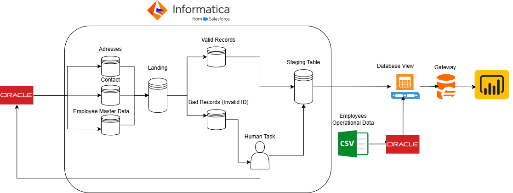
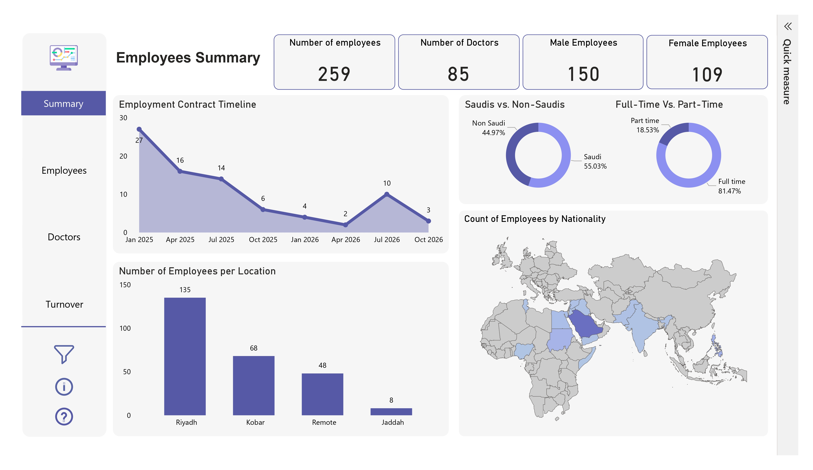

# Employee-Master-Data-Consolidation-Operational-Analytics-Framework
   

## 📋 Executive Summary
This project establishes a robust end-to-end data pipeline that consolidates fragmented employee data from hybrid sources (Oracle & CSV) into a unified "Golden Record." 

The solution features a **Human-in-the-Loop** quality gate for error remediation, a **Closed-Loop** write-back mechanism to fix source systems, and seamless integration with **Power BI** via an On-Premises Data Gateway for operational insights.

---

## 🛠 Tech Stack
* **ETL & Data Quality:** Informatica Developer (IDQ 10.x), Human Task (Analyst Tool)
* **Storage:** Oracle Database (Relational), CSV Flat Files (Structured)
* **Integration:** Microsoft On-Premises Data Gateway
* **Analytics:** Power BI Desktop/Service
* **Languages:** SQL, Informatica Expression Language

---

## 🏗 Data Architecture & Workflow



### Key Features
1.  **Hybrid Ingestion:** Merges structured relational data with flat-file employee records.
2.  **Array Denormalization:** Converts 1-to-Many relationships (e.g., multiple addresses) into single-cell arrays `(addr1, addr2)`.
3.  **Looping Remediation:** Automatically re-processes fixed records to ensure total compliance.
4.  **Source Rehabilitation:** Pushes corrections back to the Oracle source system.

---

## 🚀 Project Phases

### Phase 1: Data Ingestion & Object Modeling
**Objective:** Establish a unified "Landing Zone" to ingest and standardize raw data.
* **Hybrid Source Integration:** Configured connections for **Oracle Database** (Relational Data: Addresses, Contact Info) and **CSV Flat Files** (Structured Data: Employee Records).
* **Customized Data Objects:** Created **Physical Data Objects (PDOs)** within Informatica to represent the incoming entities, ensuring a unified schema for the "Landing" stage.

### Phase 2: Advanced Transformation & Quality Rules
**Objective:** Cleanse data and handle complex relationships.
* **Array Aggregation:** Implemented an **Aggregator Transformation** to denormalize 1-to-Many relationships. The logic concatenates child records into a single array format, compatible with the target Golden Record.
* **Exception Logic:** Utilized the **Exception Transformation** to strictly validate incoming rows. Records failing critical checks (e.g., Duplicate IDs, Null Keys) are segregated immediately.

### Phase 3: Exception Management & Human Stewardship
**Objective:** Operationalize a "Human-in-the-Loop" workflow.
* **Bad Record Isolation:** Invalid records are routed to a persistent **Bad Records Table**.
* **Human Task Workflow:** Configured an Informatica **Human Task** that assigns exceptions to Data Stewards via the **Analyst Tool** for manual review and correction.

### Phase 4: Reconciliation & Looping Remediation
**Objective:** Synchronize corrected data using a robust feedback loop.
* **Looping Workflow Design:** Designed a workflow utilizing an **Exclusive Gateway**. Fixed records from the Human Task loop back into the main pipeline for re-validation.
* **Conditional Loading Logic (The 3 Rules):**
    1.  **Insert:** New valid records are added to Staging.
    2.  **Update:** Changed records in Staging are updated.
    3.  **Recovery:** Records fixed by the Human Task are promoted from "Bad Records" to "Staging".
* **Source Write-Back:** Corrections made by stewards are **pushed back to the original Oracle Source**, ensuring the root cause is fixed permanently.

### Phase 5: Operational Integration (The Golden View)
**Objective:** Bridge "Clean Master Data" with "Day-to-Day Operations."
* **Database View Creation:** Created a unified SQL View (`VW_EMP_MASTER_OPS`) joining the clean **Staging Table** with **Employee Operational Data** (Performance, Attendance).
* **Result:** A single structure linking *who the employee is* (Master Data) with *what the employee does* (Operational Data).

### Phase 6: Infrastructure & Connectivity
**Objective:** Securely expose on-premise data to the cloud.
* **Microsoft On-Premises Data Gateway:** Installed to act as a secure bridge.
* **Bridge Configuration:** Allows the cloud-based Power BI Service to query the on-premise Oracle View in real-time without exposing the database to the public internet.

### Phase 7: Analytics & Visualization
**Objective:** Deliver actionable insights.
* **Power BI Dashboard:** Developed a dashboard connected via the Gateway.
* **Insights:** Visualizations reflect accurate, deduplicated employee data enriched with operational metrics.

---

## 📖 The Project Story

> "Our journey began with a fragmented data landscape—employee details were scattered across Oracle databases and loose CSV files. During the **Data Ingestion & Object Modeling** phase, we unified these streams into a centralized Landing Zone, treating the CSV files as structured data sources alongside our relational tables.
>
> Moving to the **Advanced Transformation & Quality Rules** phase, we applied intelligent transformations, specifically focusing on converting complex address lists into clean, readable arrays. Instead of discarding errors, the **Exception Management & Human Stewardship** phase introduced a 'Human Safety Net'—routing bad data to stewards for manual repair.
>
> The **Reconciliation & Looping Remediation** phase represents the core intelligence of our system. We implemented a looping workflow where fixed records are re-processed to ensure total compliance. Crucially, when a steward fixes a record, our engine doesn't just fix the report; it heals the *source* via a write-back mechanism, ensuring that error never happens again.
>
> By the **Operational Integration** phase, we had trusted Master Data, but data needs context. We integrated this clean data with operational metrics via a unified Database View. Finally, in the **Infrastructure & Connectivity** and **Analytics & Visualization** phases, we bridged the on-premise world with the cloud using the Microsoft Gateway, delivering a live Power BI dashboard.
>
> The result is a system where data isn't just stored—it is actively cleaned, synchronized, and transformed into trusted business intelligence."

---

## 💻 Conditional Logic Snippet
*Pseudo-code for the loading strategy:*

```sql
-- Case 1: New Insert
IF Record IS VALID AND NOT IN Staging THEN
    INSERT INTO Staging_Table;

-- Case 2: Update
ELSE IF Record IS VALID AND IN Staging THEN
    UPDATE Staging_Table SET Columns = New_Values;

-- Case 3: Recovery (Post-Human Task)
ELSE IF Record WAS IN Bad_Records AND IS NOW FIXED THEN
    DELETE FROM Bad_Records;
    INSERT INTO Staging_Table;
    -- Write-Back to Source
    UPDATE Oracle_Source_Table SET Columns = Fixed_Values;
END IF;
```
---

## 📊 Live Dashboard Demo

Experience the full interactive report. Click the preview image or the button below to open the Power BI Dashboard.

[](https://app.powerbi.com/view?r=eyJrIjoiNWE3MzY1MTEtYWZhNy00MGRlLWJjYmUtY2FlNThjMzI1MGZiIiwidCI6ImVhZjYyNGM4LWEwYzQtNDE5NS04N2QyLTQ0M2U1ZDc1MTZjZCIsImMiOjh9)

<br>

<div align="center">
  
  [](https://app.powerbi.com/view?r=eyJrIjoiNWE3MzY1MTEtYWZhNy00MGRlLWJjYmUtY2FlNThjMzI1MGZiIiwidCI6ImVhZjYyNGM4LWEwYzQtNDE5NS04N2QyLTQ0M2U1ZDc1MTZjZCIsImMiOjh9)

</div>
